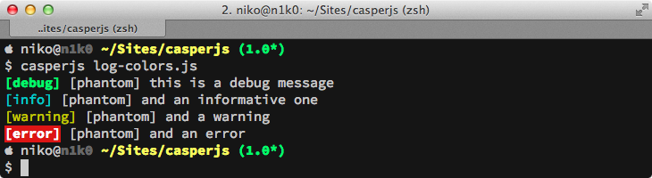

.. _logging:

.. index:: Logging, log levels

=======
Logging
=======

CasperJS allows logging using the :ref:`casper.log() <casper_log>` method and these standard event levels:

- ``debug``
- ``info``
- ``warning``
- ``error``

Sample use::

    var casper = require('casper').create();
    casper.log('plop', 'debug');
    casper.log('plip', 'warning');

.. index:: verbose

Now, there are two things to distinguish: log *storage* and log *display*; by default CasperJS won't print the logs to the standard output. In order to do so, you must enable the ``verbose`` Casper option::

    var casper = require('casper').create({
        verbose: true
    });

Also, by default Casper is configured to filter logging which is under the ``error`` level; you can override this setting by configuring the ``logLevel`` option::

    var casper = require('casper').create({
        verbose: true,
        logLevel: 'debug'
    });

You can also dump a JSON log of your Casper suite just by rendering the contents of the ``Casper.logs`` property::

    var casper = require('casper').create({
    // ...
    casper.run(function() {
        require('utils').dump(this.logs);
        this.exit();
    });

Last, if you print log messages to the standard output using the ``verbose`` option, you'll get some fancy colors::

    var casper = require('casper').create({
        verbose: true,
        logLevel: 'debug'
    })
    casper.log('this is a debug message', 'debug');
    casper.log('and an informative one', 'info');
    casper.log('and a warning', 'warning');
    casper.log('and an error', 'error');
    casper.exit();

This will give the following output:

   image

.. hint::

   CasperJS doesn't write logs on the filesystem. You have to implement this by yourself if needed.
