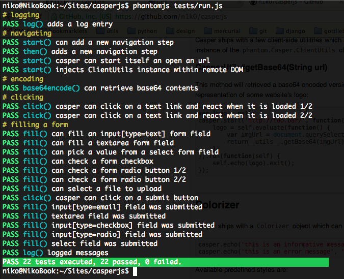

.. _colorizer_module:

.. index:: Colors, colorizer

========================
The ``colorizer`` module
========================

The ``colorizer`` module contains a ``Colorizer`` class which can generate ANSI colored strings::

    var colorizer = require('colorizer').create('Colorizer');
    console.log(colorizer.colorize("Hello World", "INFO"));

Though most of the times you will use it transparently using the :ref:`Casper.echo() <casper_echo>` method::

    casper.echo('an informative message', 'INFO'); // printed in green
    casper.echo('an error message', 'ERROR');      // printed in red

Skipping CasperJS styling operations
------------------------------------

If you wish to skip the whole coloration operation and get uncolored plain text, just set the ``colorizerType`` casper option to ``Dummy``::

    var casper = require('casper').create({
        colorizerType: 'Dummy'
    });

    casper.echo("Hello", "INFO");

.. index:: Windows

.. note::

   That's especially useful if you're using CasperJS on the Windows platform, as there's no support for colored output on this platform.

.. _colorizer_styles:

.. index:: Printing styles

Available predefined styles
---------------------------

Available predefined styles are:

- ``ERROR``: white text on red background
- ``INFO``: green text
- ``TRACE``: green text
- ``PARAMETER``: cyan text
- ``COMMENT``: yellow text
- ``WARNING``: red text
- ``GREEN_BAR``: white text on green background
- ``RED_BAR``: white text on red background
- ``INFO_BAR``: cyan text
- ``WARN_BAR``: white text on orange background

Here's a sample output of what it can look like:

``colorize()``
-------------------------------------------------------------------------------

**Signature:** ``colorize(String text, String styleName)``

Computes a colored version of the provided text string using a given predefined style::

    var colorizer = require('colorizer').create();
    console.log(colorizer.colorize("I'm a red error", "ERROR"));

.. note::

   Most of the time you won't have to use a ``Colorizer`` instance directly as CasperJS provides all the necessary methods.

See the list of the :ref:`predefined styles available <colorizer_styles>`.

``format()``
-------------------------------------------------------------------------------

**Signature:** ``format(String text, Object style)``

Formats a text string using the provided style definition. A style definition is a standard javascript ``Object`` instance which can define the following properties:

- String ``bg``: background color name
- String ``fg``: foreground color name
- Boolean ``bold``: apply bold formatting
- Boolean ``underscore``: apply underline formatting
- Boolean ``blink``: apply blink formatting
- Boolean ``reverse``: apply reverse formatting
- Boolean ``conceal``: apply conceal formatting

.. note::

   Available color names are ``black``, ``red``, ``green``, ``yellow``, ``blue``, ``magenta``, ``cyan`` and ``white``::

       var colorizer = require('colorizer').create();
       colorizer.format("We all live in a yellow submarine", {
           bg:   'yellow',
           fg:   'blue',
           bold: true
       });

