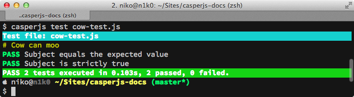
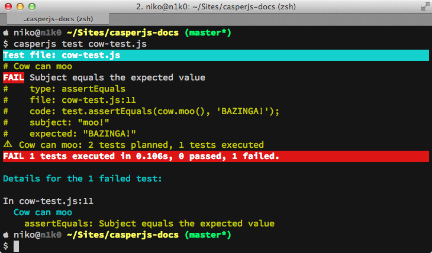
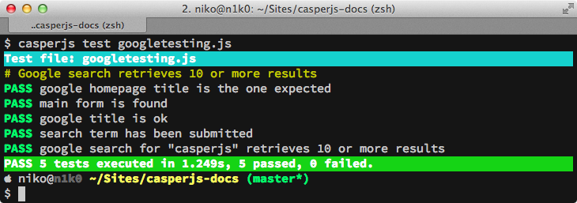

.. _testing:

.. index:: Testing

=======
Testing
=======

CasperJS ships with its own :doc:`testing framework <modules/tester>`, providing a handful set of tools to ease testing your webapps.

.. warning::

    .. versionchanged:: 1.1

    The testing framework — hence its whole API — can only be used when using the ``casperjs test`` subcommand:

    - If you try to use the ``casper.test`` property out of the testing environment, you'll get an error;
    - As of 1.1-beta3, you can't override the preconfigured ``casper`` instance in this test environment. You can read more about the whys in the :ref:`dedicated FAQ entry <faq_test_casper_instance>`.

.. index:: Unit testing

Unit testing
------------

Imagine a dumb ``Cow`` object we want to unit test::

    function Cow() {
        this.mowed = false;
        this.moo = function moo() {
            this.mowed = true; // mootable state: don't do that at home
            return 'moo!';
        };
    }

Let's write a tiny test suite for it::

    // cow-test.js
    casper.test.begin('Cow can moo', 2, function suite(test) {
        var cow = new Cow();
        test.assertEquals(cow.moo(), 'moo!');
        test.assert(cow.mowed);
        test.done();
    });

Run the tests using the ``casperjs test`` command:

.. code-block:: text

    $ casperjs test cow-test.js

You should theoretically get something like this:

Make it fail::

    casper.test.begin('Cow can moo', 2, function suite(test) {
        var cow = new Cow();
        test.assertEquals(cow.moo(), 'BAZINGA!');
        test.assert(cow.mowed);
        test.done();
    });

You'll get this instead:

.. hint::

   The whole ``tester`` module API is documented :doc:`here <modules/tester>`.

.. index:: Functional testing, Browser testing, Test suite

Browser tests
-------------

Now let's write a suite for testing google search (yes, you read it well)::

    // googletesting.js
    casper.test.begin('Google search retrieves 10 or more results', 5, function suite(test) {
        casper.start("http://www.google.fr/", function() {
            test.assertTitle("Google", "google homepage title is the one expected");
            test.assertExists('form[action="/search"]', "main form is found");
            this.fill('form[action="/search"]', {
                q: "casperjs"
            }, true);
        });

        casper.then(function() {
            test.assertTitle("casperjs - Recherche Google", "google title is ok");
            test.assertUrlMatch(/q=casperjs/, "search term has been submitted");
            test.assertEval(function() {
                return __utils__.findAll("h3.r").length >= 10;
            }, "google search for \"casperjs\" retrieves 10 or more results");
        });

        casper.run(function() {
            test.done();
        });
    });

Now run the tests suite:

.. code-block:: text

    $ casperjs test googletesting.js

You'll probably get something like this:

Advanced techniques
-------------------

The :ref:`Tester#begin() <tester_begin>` accepts either a function or an object to describe a suite; the object option allows to set up ``setUp()`` and ``tearDown()`` functions::

    // cow-test.js
    casper.test.begin('Cow can moo', 2, {
        setUp: function(test) {
            this.cow = new Cow();
        },

        tearDown: function(test) {
            this.cow.destroy();
        },

        test: function(test) {
            test.assertEquals(this.cow.moo(), 'moo!');
            test.assert(this.cow.mowed);
            test.done();
        }
    });

.. _test_subcomand:

Test command args and options
-----------------------------

Arguments
~~~~~~~~~

The ``capserjs test`` command will treat every passed argument as file or directory paths containing tests. It will recursively scan any passed directory to search for ``*.js`` or ``*.coffee`` files and add them to the stack.

.. warning ::

   There are two important conditions when writing tests:

   - You **must not** create a new ``Casper`` instance in a test file;
   - You **must** call ``Tester.done()`` when all the tests contained in a suite (or in a file) have been executed.

Options
~~~~~~~

Options are prefixed with a double-dash (``--``):

- ``--xunit=<filename>`` will export test suite results in a :ref:`XUnit XML file <xunit_report>`
- ``--direct`` or ``--verbose``  will print :doc:`log messages <logging>` directly to the console
- ``--log-level=<logLevel>`` sets the logging level (see the :doc:`related section <logging>`)
- ``--auto-exit=no`` prevents the test runner to exit when all the tests have been executed; this usually allows performing supplementary operations, though implies to exit casper manually listening to the ``exit`` tester event::

    // $ casperjs test --auto-exit=no
    casper.test.on("exit", function() {
      someTediousAsyncProcess(function() {
        casper.exit();
      });
    });

.. versionadded:: 1.0

- ``--includes=foo.js,bar.js`` will include the ``foo.js`` and  ``bar.js`` files before each test file execution;
- ``--pre=pre-test.js`` will add the tests contained in ``pre-test.js`` **before** executing the whole test suite;
- ``--post=post-test.js`` will add the tests contained in ``post-test.js`` **after** having executed the whole test suite;
- ``--fail-fast`` will terminate the current test suite as soon as a first failure is encountered.
- ``--concise`` will create a more concise output of the test suite.
- ``--no-colors`` will create an output without (beautiful) colors from casperjs.

Sample custom command:

.. code-block:: text

    $ casperjs test --includes=foo.js,bar.js \
                    --pre=pre-test.js \
                    --post=post-test.js \
                    --direct \
                    --log-level=debug \
                    --fail-fast \
                    test1.js test2.js /path/to/some/test/dir

.. warning::

   .. deprecated:: 1.1
   ``--direct`` option has been renamed to ``--verbose``, though ``--direct`` will still works, while is to be considered deprecated.

.. hint::

   A `demo gist <https://gist.github.com/3813361>`_ is also available in order to get you started with a sample suite involving some of these options.

.. _xunit_report:

.. index:: XUnit, XML, Jenkins, Continuous Integration

Exporting results in XUnit format
---------------------------------

CasperJS can export the results of the test suite to an XUnit XML file, which is compatible with continuous integration tools such as `Jenkins <http://jenkins-ci.org/>`_. To save the XUnit log of your test suite, use the ``--xunit`` option:

.. code-block:: text

    $ casperjs test googletesting.js --xunit=log.xml

You should get a pretty XUnit XML report like this:

.. code-block:: xml

    <?xml version="1.0" encoding="UTF-8"?>
    <testsuites duration="1.249">
        <testsuite errors="0" failures="0" name="Google search retrieves 10 or more results" package="googletesting" tests="5" time="1.249" timestamp="2012-12-30T21:27:26.320Z">
            <testcase classname="googletesting" name="google homepage title is the one expected" time="0.813"/>
            <testcase classname="googletesting" name="main form is found" time="0.002"/>
            <testcase classname="googletesting" name="google title is ok" time="0.416"/>
            <testcase classname="googletesting" name="search term has been submitted" time="0.017"/>
            <testcase classname="googletesting" name="google search for &quot;casperjs&quot; retrieves 10 or more results" time="0.001"/>
            <system-out/>
        </testsuite>
    </testsuites>

CasperJS own tests
------------------

CasperJS has its own unit and functional test suite, located in the ``tests`` subfolder. To run this test suite:

.. code-block:: text

    $ casperjs selftest

.. note::

   Running this test suite is a great way to find any bug on your platform. If it fails, feel free to `file an issue <https://github.com/n1k0/casperjs/issues/new>`_ or to ask on the `CasperJS mailing-list <https://groups.google.com/forum/#!forum/casperjs>`_.

.. index:: extending

Extending Casper for Testing
----------------------------

This command:

.. code-block:: text

    $ casperjs test [path]

is just a shortcut for this one:

.. code-block:: text

    $ casperjs /path/to/casperjs/tests/run.js [path]

So if you want to extend Casper capabilities for your tests, your best bet is to write your own runner and extend the casper object instance from there.

.. hint::

   You can find the default runner code in `run.js <https://github.com/n1k0/casperjs/blob/master/tests/run.js>`_.
